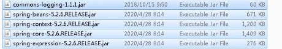
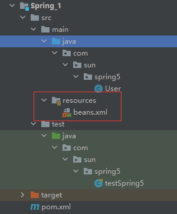
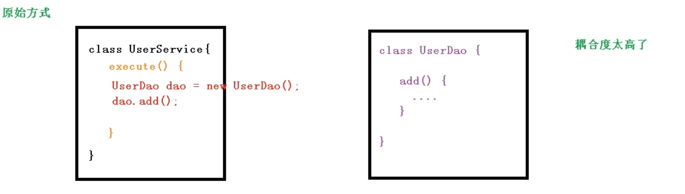
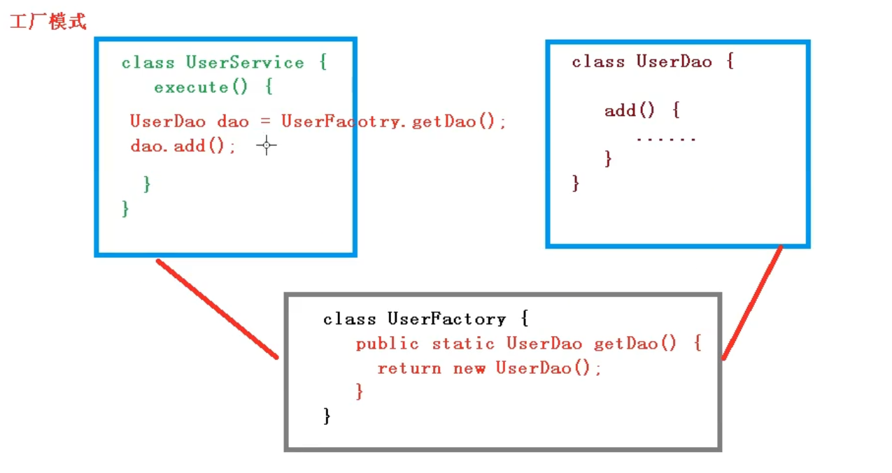
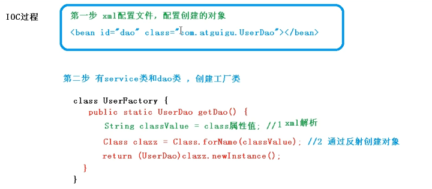
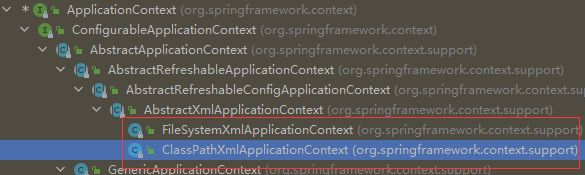

***
## 课程内容

 **1.  Spring概念
 2.  IOC容器
 3. Aop
 4. Jdbc Template
 5. 事物管理
 6. Spring5新特性**

***

 ## Spring框架的基本概述
 
 1. Spring是一个轻量级的开源的javaEE框架。
 1. Spring框架可以解决企业应用开发的复杂性。
 2.  Sping中有两个核心部分，IOC和Aop
 3. IOC：控制反转，把创建对象的过程交给Spring进行管理。
 4.  Aop：面向切面，不修改源代码的情况下进行功能的添加，功能的增强。
 5. Spring特点
 6.  方便解耦，简化开发。
 7. Aop编程支持。
 
	 1. 方便程序测试。
	 1. 方便与其他框架的整合。
	 1. 方便进行事物操作。
	 1. Spring源码是经典之作，适合研究学习。**

## 入门案例
1. **导入基本包**

```xml
    <dependencies>
        <dependency>
            <groupId>org.springframework</groupId>
            <artifactId>spring-context</artifactId>
            <version>5.2.13.RELEASE</version>
        </dependency>
        <!-- https://mvnrepository.com/artifact/org.springframework/spring-core -->
        <dependency>
            <groupId>org.springframework</groupId>
            <artifactId>spring-core</artifactId>
            <version>5.2.13.RELEASE</version>
        </dependency>
        <!-- https://mvnrepository.com/artifact/org.springframework/spring-beans -->
        <dependency>
            <groupId>org.springframework</groupId>
            <artifactId>spring-beans</artifactId>
            <version>5.2.13.RELEASE</version>
        </dependency>
        <!-- https://mvnrepository.com/artifact/org.springframework/spring-expression -->
        <dependency>
            <groupId>org.springframework</groupId>
            <artifactId>spring-expression</artifactId>
            <version>5.2.13.RELEASE</version>
        </dependency>
        <!-- https://mvnrepository.com/artifact/commons-logging/commons-logging -->
        <dependency>
            <groupId>commons-logging</groupId>
            <artifactId>commons-logging</artifactId>
            <version>1.1.1</version>
        </dependency>

    </dependencies>
```



 2. **创建一个普通类**

```java
public class User
{
    public void add(){
        System.out.println("add....");
    }
}
```

3. **创建一个配置文件**
```xml
 <?xml version="1.0" encoding="UTF-8"?>
<beans xmlns="http://www.springframework.org/schema/beans"
       xmlns:xsi="http://www.w3.org/2001/XMLSchema-instance"
       xsi:schemaLocation="http://www.springframework.org/schema/beans http://www.springframework.org/schema/beans/spring-beans.xsd">

    <!--配置bean对象索引-->
    <bean id="user" class="com.sun.spring5.User"></bean>
	
</beans>
```
 4. **进行代码测试**
 ```java
	 @Test
    public void testAdd(){
        //1.加载Spring配置文件
        ClassPathXmlApplicationContext context = new ClassPathXmlApplicationContext("beans.xml");
        //2.获取配置文件中的对象
         User user = context.getBean("user", User.class);

        System.out.println(user);

        user.add();
    }
```

## IOC--基于xml方式的bean管理

 ### 什么是IOC
  
  1. **控制反转，把对象的创建和对象之间调用的过程交给spring。**
  2. **目的让耦合度降低**。
    
#### IOC的底层原理
  1. **xml解析，工厂模式，反射** 
  2. **让耦合度降低的最低水平**
    






#### IOC接口
1. **IOC思想给予IOC容器完成，IOC容器底层就是对象工厂*
2. Spring提供IOC容器实现两种方式：（l两个接口）
	1）. BeanFactory：IOC 容器中基本实现，是Spring内部的使用接口，不提供开发人员进行使用。
	**加载配置文件的时候不会创建对象，在获取对象或者说去使用对象的时候，采取创建对象**
	2）. ApplicationContex，接口的子接口，提供更多更强大的功能，一般由开发人员进行使用。
	**在加载配置文件的时候就会把在配置文件中的对象进行创建。**
	**在实际web项目中，一般将一些耗时耗资源的项目都交给服务器在启动的时候完成，而不是在调用的时候再加载资源，所以第二种用的比较多。**
	
3. Application中的实现类
	

### IOC操作Bean管理---基本属性注入
 1. **什么是Bean管理**。
	   0). Bean管理的两个操作
	   1). Spring创建对象
	   2). Spring注入属性
 2. **Bean管理xml有两种方式**
	1). 基于xml配置文件方式实现
	2). 基于注解方式实现  
 3. **基于xml配置文件方式实现**
	 ```xml
	  <bean id="user" class="com.sun.spring5.User"></bean>
	```
	 1）.创建对象时默认执行无参数构造方法。
	 
  4. 基于xml方法注入属性
	  1）.DI,依赖注入，就是注入属性 
	  
 #### **使用set方法进行注入：创建对象 注入属性**
```xml
   <bean id="duck" class="com.sun.spring5.Dock">
        <property name="name" value="sun"></property>
   </bean>
```
**使用有参构造器进行注入**
  1. 创建类，定义属性，创建属性对应有参数的构造方法。
  ```java
  public class Dock {

    //创建属性
    private String name;
    private String author;

    public Dock(String name,String author){
        this.name=name;
        this.author=author;
    }
}
  ```
2. 在配置文件中进行配置
 ```xml
   <bean id="dock" class="com.sun.spring5.Dock">
        <constructor-arg name="name" value="《西厢记》"></constructor-arg>
        <constructor-arg name="author" value="千岛湖"></constructor-arg>
    </bean>
 ```
 
 **简化版的set注入--p名称空间注入，了解，并不常用**
 
1. 添加p名称空间在xml中
 ```xml
 <beans xmlns="http://www.springframework.org/schema/beans"
       xmlns:xsi="http://www.w3.org/2001/XMLSchema-instance"
       xmlns:p="http://www.springframework.org/schema/p"
       xsi:schemaLocation="http://www.springframework.org/schema/beans http://www.springframework.org/schema/beans/spring-beans.xsd">
 ```
 2. beans中进行属性注入
 ```xml
	 <bean id="user" class="com.sun.spring5.User" p:name="张无忌" ></bean>	
```
  #### **变量**
 1. 注入空值
 ```xml
      <property name="adress">
            <null/>
       </property>
 ```
 2. 属性值中包含特殊符号
    1). 把特殊符号“<>”进行转移
    ```xml
	  <property name="adress" value="&lt;<南京>&gt; "></property>
	```
    2)把特殊符号写到CDATA
    ```xml
	        <property name="adress">
             <value><![CDATA[<<南京>>]]></value>
        </property>
	```
3. 注入属性，外部bean和级联辅助
	1)..创建连各类，server类和dao类
	2).在service中调用dao里面的方法 
	3).在spring配置文件中进行配置
	```xml
	<bean id="userService" class="com.sun.service.UserService">
        <property name="userDao" ref="userDao"></property>
    </bean>
	
    <bean id="userDao" class="com.sun.dao.UserDao"></bean>
	```
4.  注入属性，内部bea和级联赋值
	1）.一对多的关系，部门和员工，一个部门有多个员工，一个员工属于一个部门。
	2). 在实体类之间表示一对多的关系。运功所属部门用部门对象进行表示
	```java
	public class Dept {
		private  String dname;

		public void setDname(String dname) {
			this.dname = dname;
		}
	}

	```
	```java
	public class emp {
    private  String ename;
    private String gender;


    //员工属于某一个部门
    private Dept dept;
		public String getEname() {
			return ename;
		}

		public void setEname(String ename) {
			this.ename = ename;
		}

		public void setDept(Dept dept) {
			this.dept = dept;
		}
	}
	```
	
	```xml
	 <!--内部类-->
    <bean id="emp" class="com.sun.bean.Emp">
        <!--设置两个普通属性-->
        <property name="ename" value="lucy"></property>
        <property name="gender" value="女"></property>
        <!--设置对象类型属性-->
        <property name="dept">
            <bean id="dept" class="com.sun.bean.Dept">
                <property name="dname" value="安保部"></property>
            </bean>
        </property>
    </bean>
	```
5. 注入属性级联赋值
	1).第一种写法 
	  ```xml
	 <bean id="emp" class="com.sun.bean.Emp">
			<!--设置两个普通属性-->
			<property name="ename" value="lucy"></property>
			<property name="gender" value="女"></property>
			<!--设置对象类型属性-->
			<!--级联赋值-->
			<property name="dept" ref="dept"></property>
    </bean>
    <bean id="dept" class="com.sun.bean.Dept">
			<property name="dname" value="财务部"></property>
    </bean>
	  ```
	  2）第二种写法
	  ```xml
	  <bean id="emp" class="com.sun.bean.Emp">
			<!--设置两个普通属性-->
			<property name="ename" value="lucy"></property>
			<property name="gender" value="女"></property>
			<!--设置对象类型属性-->
			<!--级联赋值-->
			<property name="dept" ref="dept"></property>
			<!--需要申城dept中的get方法-->
			<property name="dept.dname" value="技术部"></property>
    </bean>
    <bean id="dept" class="com.sun.bean.Dept">
			<property name="dname" value="财务部"></property>
    </bean>
	  ```
	  
 #### **xml注入集合类型属性**
1. 注入数组集合类型属性
2. 注入List集合类型属性
3. 注入Map集合类型属性

```java
public class Stu {

    private String courses[];

    private List<String> list;

    private Map<String,String> map;

    private Set<String> set;

    public Stu() {
    }

    public void setCourses(String[] courses) {
        this.courses = courses;
    }

    public void setList(List<String> list) {
        this.list = list;
    }

    public void setMap(Map<String, String> map) {
        this.map = map;
    }

    public void setSet(Set<String> set) {
        this.set = set;
    }
}
```
```xml
<bean id="stu" class="com.sun.collectiontype.Stu">
        <!--数组类型注入-->
        <property name="courses">
            <array>
                <value>java课程</value>
                <value>数据库课程</value>
                <value>计算机网络</value>
            </array>
        </property>

        <property name="list">
            <list>
                <value>张三</value>
                <value>小三</value>
            </list>
        </property>

        <property name="map">
            <map>
                <entry key="JAVA" value="java"></entry>
                <entry key="PHP" value="php"></entry>
            </map>
        </property>
        <property name="set">
            <set>
                <value>MySQL</value>
                <value>Redis</value>
            </set>


        </property>

</bean>
```

 #### **细节问题**
1. 在集合里面设置对象类型值
  ```java
     private List<Course> coursesList;
  ```
```xml
       <property name="coursesList">
            <list>
                <ref bean="course1"></ref>
				
                <ref bean="course2"></ref>
            </list>
       </property>
```

```xml
    <!--创建多个course对象-->
    <bean id="course1" class="com.sun.collectiontype.Course">
        <property name="cname" value="Spring5框架"></property>
    </bean>
    
    <bean id="course2" class="com.sun.collectiontype.Course">
        <property name="cname" value="MyBatis框架"></property>
    </bean>
```
2. 把集合注入的部分提取出来作为一个公共部分
	1). 在spring配置文件中引入名称空间util 。
	``` xml
	<?xml version="1.0" encoding="UTF-8"?>
	<beans xmlns="http://www.springframework.org/schema/beans"
		   xmlns:xsi="http://www.w3.org/2001/XMLSchema-instance"
		   xmlns:p="http://www.springframework.org/schema/p"

		   xmlns:util="http://www.springframework.org/schema/util"
		   xsi:schemaLocation="http://www.springframework.org/schema/beans http://www.springframework.org/schema/beans/spring-beans.xsd 
		   
				http://www.springframework.org/schema/util http://www.springframework.org/schema/util/spring-util.xsd" 
	```


	 2). 使用util标签完成list集合注入提取
	 ```xml
	<!--提取list集合属性注入、-->

    <util:list id="bookList">
        <value>《易筋经》</value>
        <value>《九阳神功》</value>
        <value>《血刀》</value>
    </util:list>
    
    <!--  提取list属性进行注入  -->
    <bean id="book" class="com.sun.collectiontype.Book">
        <property name="list" ref="bookList"></property>
    </bean>
	 ```
 
### IOC操作Bean管理----FactoryBean

#### 前言
1. Spring有两种类型bean，一种是普通bean，另外一种是工厂bean(FactoryBean)
2. 普通bean：定义什么类型返回什么类型。
3. 工厂bean：定义的类型不一定是返回的类型。
	1). 创建类，让这个类作为工厂bean，实现接口FactoryBean。
	2). 实现接口里面的方法，在实现的方法中定义返回bean的类型。
	```java
	import org.springframework.beans.factory.FactoryBean;

	public class MyBean implements FactoryBean<Course> {

		//定义一下返回的bean的对象
		@Override
		public Course getObject() throws Exception {
			Course course=new Course();
			course.setCname("abc");
			return course;
		}

		@Override
		public Class<?> getObjectType() {
			return null;
		}

		@Override
		public boolean isSingleton() {
			return false;
		}
	}
	```
	测试方法，注意返回类型
	```java
		@Test
		public void testAdd(){
        //1.加载Spring配置文件
			ApplicationContext context = new ClassPathXmlApplicationContext("beans.xml");
			Course book = context.getBean("myBean", Course.class);
			System.out.println(book.toString());
		}

	```

#### bean的作用域
1. 在Spring里面，设置bean创建的实例是单实例还是多实例。
	1. Spring里面，默认情况下是一个单实例对象，每次获取的对象地址相同。
2. 如何设置单实例，还是多实例。
	1. bean标签中的scope属性用来设置单实例还是多实例。
	2. scope属性值：默认值 singleton，表示单实例对象，pototype，表示多实例对象。
	```xml
	<bean id="book" class="com.sun.collectiontype.Book" scope="prototype">
		<property name="list" ref="bookList"></property>
    </bean>
	```
3. singleton和prototype区别
	1. 单双实例的区别
	2. 在scope值是singleton时候，在加载Spring配置文件的时候   ==（执行ApplicationContext context = new ClassPathXmlApplicationContext("beans.xml");的时候） #E91E63==就会创建单实例对象。在scope的值是prototype的时候，不是加载spring配置文件的时候创建对象，而在调用getBean()方法的时候创建多实例对象。

#### bean的生命周期
1. 生命周期：从对象的创建到生命销毁的过程
   
2. bean的生命周期
	1. 听过构造器创建bean实例(无参构造)
	2. 为bean的属性设置和对其他bean引用(调用set方法)
	3. 调用bean中初始化的方法（需要进行配置）
	4. bean可以使用了（对象获取到了）
	5. 当容器关闭的时候，调用bean的销毁的方法（需要进行配置销毁的方法）
3. 生命周期演示核心代码
   
   创建类
	 ```java
	public class Orders {
    private String oname;

		public Orders(){
			System.out.println("第一步：执行了无参数的构造，创建bean实例");
		}
		public void setOname(String oname) {
			System.out.println("第二步：调用set方法设置属性值");
			this.oname = oname;
		}
		//创建一个执行的初始化方法
		public void initMethod(){
			System.out.println("第三步：执行初始化方法");
		}
		//创建执行销毁方法
		public void destroyMethod(){
			System.out.println("第五步：执行销毁方法");
		}
	}   
	 ```
	 配置文件中需要设置指定初始化方法和销毁的方法
	 ```xml
    <bean id="order" class="com.bean.Orders" init-method="initMethod" destroy-method="destroyMethod">
        <property name="oname" value="手机"></property>
    </bean>
	 ```
	 测试方法
	 ```java
	 public void testAdd() {
        //1.加载Spring配置文件
        ClassPathXmlApplicationContext context = new ClassPathXmlApplicationContext("beans.xml");
        Orders order = context.getBean("orders", Orders.class);
        System.out.println("第四步：获取到穿件实例的对象");
        System.out.println(order);
		//
        context.close();
    }
	 ```
	 执行效果
	 ```
	 第一步：执行了无参数的构造，创建bean实例
	第二步：调用set方法设置属性值
	第三步：执行初始化方法
	第四步：获取到穿件实例的对象
	com.bean.Orders@2d127a61
	第五步：执行销毁方法
	 ```
4. bean的后置处理器：bean的声明周期一共是有七步的操作。
    1. 听过构造器创建bean实例(无参构造)
	2. 为bean的属性设置和对其他bean引用(调用set方法)
	3. ==把bean的实例传递bean的后置处理器的方法 postProcessBeforeInitialization() #F44336==
	3. 调用bean中初始化的方法（需要进行配置）
	4. ==把bean的实例传递bean的后置处理器的方法 postProcessAfterInitialization()  #F44336==
	4. bean可以使用了（对象获取到了）
	5. 当容器关闭的时候，调用bean的销毁的方法（需要进行配置销毁的方法）
5. 演示添加后置处理器效果
	1. 创建类，实现接口BeanPostProcessor，创建后置处理器
	   ```java
		public class MyBeanPost implements BeanPostProcessor {
		
			public Object postProcessBeforeInitialization(Object bean, String beanName) throws BeansException {
				System.out.println("在初始化之前执行的方法");
				return bean;
			}

			@Nullable
			public Object postProcessAfterInitialization(Object bean, String beanName) throws BeansException {
				System.out.println("在初始化之后执行的方法");
				return bean;
			}
		}
	   ```
	  2. 配置后置处理器，配置完后置处理器之后，配置文件中的每一个bean初始化前后都会执行陪配置处理里面的方法。 
		   ```xml
		      <bean id="order" class="com.bean.Orders" init-method="initMethod" destroy-method="destroyMethod">
				<property name="oname" value="手机"></property>
			</bean>
			
			<!--配置后置处理器  -->
			<bean id="myBeanPost" class="com.bean.MyBeanPost"></bean>
		   ```
	3. 执行效果
	   配置文件里面只有一个类的时候
		  ```
		 第一步：执行了无参数的构造，创建bean实例
		第二步：调用set方法设置属性值
		在初始化之前执行的方法
		第三步：执行初始化方法
		在初始化之后执行的方法
		第四步：获取到穿件实例的对象
		com.bean.Orders@8e24743
		第五步：执行销毁方法
		  ```
		  配置文件里面有多个类的时候
		  ```
		 第一步：执行了无参数的构造，创建bean实例
		第二步：调用set方法设置属性值
		在初始化之前执行的方法
		第三步：执行初始化方法
		在初始化之后执行的方法
		在初始化之前执行的方法
		在初始化之后执行的方法
		第四步：获取到穿件实例的对象
		com.bean.Orders@543c6f6d
		第五步：执行销毁方法
		  ```
		 
### IOC操作Bean管理---自动装配
#### 什么是自动装配？
1. 根据指定装配规则（属性名称或者属性类型），Spring自动将匹配的属性值进行注入。
2. 演示自动装配过程
	1. 配置自动装配 bean标签属性autowire有两个值，一个是byName，一个是byType。
	2. 根据属性名称进行自动装配：byname。==要求注入bean的id和类属性名要一致。 #F44336==
	```xml
	<bean id="emp" class="com.sun.bean.Emp" autowire="byName">
        <!--设置两个普通属性-->
        <property name="ename" value="lucy"></property>
        <property name="gender" value="女"></property>
    </bean>
	
    <bean id="dept" class="com.sun.bean.Dept">
        <property name="dname" value="财务部"></property>
    </bean>
	```
	```
	Emp{ename='lucy', gender='女', dept=Dept{dname='财务部'}}
	```
	3. 根据属性类型进行自动装配：bytype。配置文件一个相同类型的bean只能有一个，多了会报错
	 ```xml
	<bean id="emp" class="com.sun.bean.Emp" autowire="byType">
        <!--设置两个普通属性-->
        <property name="ename" value="lucy"></property>
        <property name="gender" value="女"></property>
    </bean>
	
    <bean id="dept" class="com.sun.bean.Dept">
        <property name="dname" value="财务部"></property>
    </bean>
	```
### IOC操作Bean管理----外部属性文件
1. 直接配置数据库信息
	1. 配置德鲁伊连接池
	2. 引入德鲁伊的依赖文件---jar包
	 ```xml
	 <!--    直接配置连接池-->
    <bean id="dataSource" class="com.alibaba.druid.pool.DruidDataSource">
        <property name="driverClassName" value="com.mysql.jdbc.driver"></property>
        <property name="url" value="jdbc:mysq;://localhost:3306/userDb"></property>
        <property name="username" value="root"></property>
        <property name="password" value="root"></property>
    </bean>
	 ```
2. 通过引入外部的属性文件进行配置
	1. 创建外部属性文件，properties格式文件，写数据库了信息。
	   
		``` properity
		prop.driverClass=com.mysql.jdbc.driver
		prop.url=jdbc:mysq;://localhost:3306/userDb
		prop.userName=root
		prop.password=root
		```
	2. 写入context名称空间
		``` xml
		<?xml version="1.0" encoding="UTF-8"?>
		<beans xmlns="http://www.springframework.org/schema/beans"
       xmlns:xsi="http://www.w3.org/2001/XMLSchema-instance"
       xmlns:p="http://www.springframework.org/schema/p"
       xmlns:util="http://www.springframework.org/schema/util"
       xmlns:context="http://www.springframework.org/schema/context"
       xsi:schemaLocation="http://www.springframework.org/schema/beans http://www.springframework.org/schema/beans/spring-beans.xsd
                           http://www.springframework.org/schema/util http://www.springframework.org/schema/util/spring-util.xsd
                           http://www.springframework.org/schema/context http://www.springframework.org/schema/context/spring-context.xsd">
		```
	   3.引用外部属性并使用表达式加载属性
		  ```xml
			<context:property-placeholder location="classpath:jdbc.properties"/>
			<!--    配置连接池-->
			<bean id="dataSource" class="com.alibaba.druid.pool.DruidDataSource">
				   <property name="driverClassName" value="${prop.driverClass}"/>
				   <property name="url" value="${prop.url}"></property>
				   <property name="username" value="${prop.userName}"></property>
				   <property name="password" value="${prop.password}"></property>
			</bean>
		  ``` 

## IOC--基于注解方式的bean管理 
 ### 什么是注解
 1. 注解是代码里面特殊标记，格式 @注解名称（属性名称=属性值，属性名称=属性值）
 2. **使用注解**：注解可以作用在类的上面，属性上面，方法上面
 3. **为什么使用注解**：简化xml配置。
   
 ### Spring针对Bean管理中创建对象提供注解

  **下面的四个注解功能是一样的，都可以用来创建bean实例**
 1. @Component
 2. @Service:用在业务逻辑层
 3. @Controller：用在web层，控制层
 4. @Repository：数据库层,Dao层
   ***
  ### 基于注解方式实现对象创建
  1. 引用依赖
     ```xml
		<dependency>
			<groupId>org.springframework</groupId>
			<artifactId>spring-aop</artifactId>
			<version>5.2.6.RELEASE</version>
		</dependency>
	 ```
  2. 开启组件扫描
	  1. Spring配置文件中引入context名称空间
	    ```xml
		<?xml version="1.0" encoding="UTF-8"?>
	 <beans xmlns="http://www.springframework.org/schema/beans"
       xmlns:xsi="http://www.w3.org/2001/XMLSchema-instance"
       xmlns:p="http://www.springframework.org/schema/p"
       xmlns:util="http://www.springframework.org/schema/util"
	   
       xmlns:context="http://www.springframework.org/schema/context"
	   
       xsi:schemaLocation="http://www.springframework.org/schema/beans http://www.springframework.org/schema/beans/spring-beans.xsd
                           http://www.springframework.org/schema/util http://www.springframework.org/schema/util/spring-util.xsd
						   
                           http://www.springframework.org/schema/context http://www.springframework.org/schema/context/spring-context.xsd">
		```
		2. 开启组件扫描，如果扫描多个包，多个包之间使用逗号隔开，或者扫描包的上层目录

		```xml
		<context:component-scan base-package="com.Annotation.Dao,com.Annotation.Service"></context:component-scan>
	 ```
3. 使用注解，**注解里面value属性值可以省略不写，如果不写默认值是类名的首字母小写**
	  ```java
		@Component(value = "userService") //相当于<bean id="' class=""/>
		public class UserService {
			public void addS(){
				System.out.println("Service add......");
			}
		}
	```
4. 开启组件扫描的细节配置:这只扫描过滤器。
	  ```xml
	  <!--    示例1-->
    <context:component-scan base-package="com.Annotation.Dao,com.Annotation" use-default-filters="false">
	<!--        到包里面只扫描带Controller注解的类-->
        <context:include-filter type="annotation" expression="org.springframework.stereotype.Controller"/>
    </context:component-scan>
	
    <!--    示例2-->
    <context:component-scan base-package="com.Annotation.Dao,com.Annotation">
        <!--        到包里面不去扫描带Controller注解的类-->
        <context:exclude-filter type="annotation" expression=
		"org.springframework.stereotype.Controller"/>
    </context:component-scan>
	  ```
### 基于注解方式实现属性注入
1. @AutoWired:根据属性类型进行自动注入
	1. 把service和dao对象创建：在serivce和dao类添加创建对象注解。
	  ```java
	  @Repository()
	public class UserDaoImpl im             
	 ```java
	import java.lang.reflect.InvocationHandler;
	import java.lang.reflect.Method;
	import java.lang.reflect.Proxy;
	import java.util.Arrays;

	public class JDKProxy {
		public static void main(String[] args) {
			Class[] interfaces={UserDao.class};
			UserDao userDao=new UseraDaoImpl();
			UserDao dao=(UserDao)Proxy.newProxyInstance(JDKProxy.class.getClassLoader(), interfaces, new UserDaoProxy(userDao));
			dao.add(1,2);
		}


	}
	//创建代理对象方法
	class UserDaoProxy implements InvocationHandler{

		//1. 把创建的是谁的代理对象，把谁传递进来，有参数的构造进行传递
		Object obj;
		public UserDaoProxy(Object obj){
			this.obj=obj;
		}

		//增强逻辑
		@Override
		public Object invoke(Object proxy, Method method, Object[] args) throws Throwable {

			//在方法之前
			System.out.println("方法执行前。。。。"+ method.getName()+"传递的参数"+ Arrays.toString(args));
			//被增强的方法之字形
			Object res = method.invoke(obj, args);
			//方法之后
			System.out.println("方法之后执行。。。。"+obj);
			return res;
		}
	}
	 ```
	
 
 
   