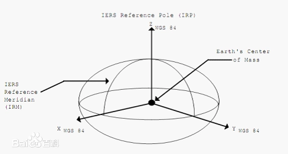

***
## 时间同步算法
1. 需求：分别指定时间原点在数据文件中的位置；若飞行数据的时间步长与噪声数据的步长不一致，需将飞行数据插值到噪声数据的时间离散点上来。
2. 思路：
   
## 基于WGS84坐标系将GPS信息转换成笛卡尔坐标系。
### 前言
1. **WGS84坐标系:** 一种国际上采用的地心坐标系。坐标原点为地球质心，其地心空间直角坐标系的Z轴指向BIH （国际时间服务机构）1984.0定义的协议地球极（CTP）方向，X轴指向BIH 1984.0的零子午面和CTP赤道的交点。
   

2. **WGS84坐标系与GPS关系:** WGS84经纬度是采用WGS-84坐标系所换算出来的经纬度，==该坐标系是目前GPS所采用的坐标系统 #F44336==。采用椭球参数为：a= 6378137m，f =1/298.257223563。
3. **GPS坐标是:** 由==经度，纬度，海拔 #E91E63==组成，精度和纬度都是角度，海报是高度。
4. **为什么要转化:** 从GPS模块中获得的坐标是属于球面坐标，并不是我们平常接触到的平面坐标，所以在计算两点间距离的时候不能简单的利用勾股定理来计算，而是要将GPS中的坐标转换为常用的平面坐标。

### GPS坐标转笛卡尔积
1. 转换方法
	1. 目前还没有找到转换的方法，但是网上都有js，python，matlab转换的源代码。
   
2. 网上JS代码实现
``` javascript
/*             geodesy routines in JavaScript
                 James R. Clynch NPS / 2003
               
          Done for support of web education pages
          == must convert inputs to numbers for safety ==
          == if string comes in - sometimes works, sometimes not !==
*/
 
 
 
<!--
 
// =======================================================================
 
     function geodGBL()
//             test and ensure geodesy globals loaded
     {
 
     var  tstglobal
 
     tstglobal = typeof EARTH_A;
     if ( tstglobal == "undefined" )  wgs84() 
 
     }
 
// =======================================================================
 
       function earthcon(ai,bi)
/*        Sets Earth Constants as globals
             --  input a,b
             --  Leaves Globals 
                 EARTH_A      EARTH_B   EARTH_F  EARTH_Ecc
*/
     {
           var  f,ecc, eccsq, a,b
 
           a        =  Number(ai);
           b        =  Number(bi);
 
           f        =  1-b/a;
           eccsq    =  1 - b*b/(a*a);
           ecc      =  Math.sqrt(eccsq);
 
           EARTH_A  =  a;
           EARTH_B  =  b;
           EARTH_F  =  f;
           EARTH_Ecc=  ecc;
           EARTH_Esq=  eccsq;
     }
 
 
// =======================================================================
 
     function wgs84()
   
/*        WGS84 Earth Constants
             --  returns a,b,f,e  --
             --  Leaves Globals 
                 EARTH_A      EARTH_B   EARTH_F  EARTH_Ecc
*/
     {
          var  wgs84a, wgs84b, wgs84f
 
          wgs84a         =  6378.137;
          wgs84f         =  1.0/298.257223563;
          wgs84b         =  wgs84a * ( 1.0 - wgs84f );
 
          earthcon (wgs84a, wgs84b );
 
     }          
 
 
// =======================================================================
 
    function  radcur(lati)
/*
       compute the radii at the geodetic latitude lat (in degrees)
     
     input:
               lat       geodetic latitude in degrees
     output:   
               rrnrm     an array 3 long
                         r,  rn,  rm   in km
*/
{
 
     var rrnrm = new Array(3)
 
     var dtr   = Math.PI/180.0
 
     var  a,b,lat
     var  asq,bsq,eccsq,ecc,clat,slat
     var  dsq,d,rn,rm,rho,rsq,r,z
 
//        -------------------------------------
 
     geodGBL();
 
     a     = EARTH_A;
     b     = EARTH_B;
 
     asq   = a*a;
     bsq   = b*b;
     eccsq  =  1 - bsq/asq;
     ecc = Math.sqrt(eccsq);
 
     lat   =  Number(lati);
 
     clat  =  Math.cos(dtr*lat);
     slat  =  Math.sin(dtr*lat);
 
     dsq   =  1.0 - eccsq * slat * slat;
     d     =  Math.sqrt(dsq);
 
     rn    =  a/d;
     rm    =  rn * (1.0 - eccsq ) / dsq;
 
     rho   =  rn * clat;
     z     =  (1.0 - eccsq ) * rn * slat;
     rsq   =  rho*rho + z*z;
     r     =  Math.sqrt( rsq );
 
     rrnrm[0]  =  r;
     rrnrm[1]  =  rn;
     rrnrm[2]  =  rm;
 
     return ( rrnrm );
 
   }
 
// =======================================================================
 
//        physical radius of earth from geodetic latitude
 
     function  rearth (lati)
     {
          var    rrnrm, r,lat
 
          lat   =  Number(lati);
 
          rrnrm =  radcur ( lat );
          r     =  rrnrm[0];
 
          return ( r );
 
     }
 
 
// =======================================================================
 
     function  gc2gd (flatgci, altkmi )
/*        geocentric latitude to geodetic latitude
     Input:
               flatgc    geocentric latitude deg.
               altkm     altitide in km
     ouput:
               flatgd    geodetic latitude in deg
*/
     {
 
     var dtr   = Math.PI/180.0;
     var rtd   = 1/dtr;
 
     var  flatgd,flatgc,altkm
     var  rrnrm = new Array(3)
     var  re,rn,ecc, esq;
     var  slat,clat,tlat
     var  altnow,ratio
 
     geodGBL();
 
     flatgc=  Number(flatgci);
     altkm =  Number(altkmi);
     
     ecc   =  EARTH_Ecc;
     esq   =  ecc*ecc;
 
//             approximation by stages
//             1st use gc-lat as if is gd, then correct alt dependence
 
     altnow  =  altkm;
 
     rrnrm   =  radcur (flatgc);
     rn      =  rrnrm[1];
     
     ratio   = 1 - esq*rn/(rn+altnow);
 
     tlat    = Math.tan(dtr*flatgc) / ratio;
     flatgd  = rtd * Math.atan(tlat);
 
//        now use this approximation for gd-lat to get rn etc.
 
     rrnrm   =  radcur ( flatgd );
     rn      =  rrnrm[1];
 
     ratio   =  1  - esq*rn/(rn+altnow)
     tlat    =  Math.tan(dtr*flatgc)/ratio;
     flatgd  =  rtd * Math.atan(tlat);
 
     return  flatgd
 
     }
 
 
// =======================================================================
 
 
     function  gd2gc (flatgdi, altkmi )
/*        geodetic latitude to geocentric latitude
     Input:
               flatgd    geodetic latitude deg.
               altkm     altitide in km
     ouput:
               flatgc    geocentric latitude in deg
*/
     {
 
     var dtr   = Math.PI/180.0;
     var rtd   = 1/dtr;
 
     var  flatgc,flatgd,altkm
     var  rrnrm = new Array(3)
     var  re,rn,ecc, esq;
     var  slat,clat,tlat
     var  altnow,ratio
 
     geodGBL();
 
     flatgd=  Number(flatgdi);
     altkm =  Number(altkmi);
     
     ecc   =  EARTH_Ecc;
     esq   =  ecc*ecc;
 
     altnow  =  altkm;
 
     rrnrm   =  radcur (flatgd);
     rn      =  rrnrm[1];
     
     ratio   = 1 - esq*rn/(rn+altnow);
 
     tlat    = Math.tan(dtr*flatgd) * ratio;
     flatgc  = rtd * Math.atan(tlat);
 
     return  flatgc;
 
     }
 
 
// =======================================================================
 
     function  llenu ( flati,floni)
/*        latitude longitude to east,north,up unit vectors
     input:
               flat      latitude in degees N
                         [ gc -> gc enu,  gd usual enu ]
               flon      longitude in degrees E
     output:
               enu[3[3]]  packed 3-unit vectors / each a 3 vector
*/
     {
 
     var  flat,flon;
     var  dtr,clat,slat,clon,slon  ;
     var  ee = new Array(3);
     var  en = new Array(3);
     var  eu = new Array(3);
 
     var  enu = new Array(3);
 
     var dtr   = Math.PI/180.0
 
 
//             --------------------------------
 
     flat = Number(flati);
     flon = Number(floni);
 
     clat = Math.cos(dtr*flat);
     slat = Math.sin(dtr*flat);
     clon = Math.cos(dtr*flon);
     slon = Math.sin(dtr*flon);
 
     ee[0]  =  -slon;
     ee[1]  =   clon;
     ee[2]  =   0.0;
 
     en[0]  =  -clon * slat;
     en[1]  =  -slon * slat;
     en[2]  =          clat;
 
     eu[0]  =   clon * clat;
     eu[1]  =   slon * clat;
     eu[2]  =          slat;
 
     enu[0] =  ee;
     enu[1] =  en;
     enu[2] =  eu;
 
     return  enu ;
 
     }
 
// =======================================================================
 
       function llhxyz (flati,floni, altkmi )
/*        lat,lon,height to xyz vector
     input:
          flat      geodetic latitude in deg
          flon      longitude in deg
          altkm     altitude in km
     output:
          returns vector x 3 long ECEF in km
*/
     {
 
      var  dtr =  Math.PI/180.0;
      var  flat,flon,altkm;
      var  clat,clon,slat,slon;
      var  rrnrm = new Array(3);
      var  rn,esq;
      var  x,y,z;
      var  xvec = new Array(3);
 
     geodGBL();
 
     flat  = Number(flati);
     flon  = Number(floni);
     altkm = Number(altkmi);
 
     clat = Math.cos(dtr*flat);
     slat = Math.sin(dtr*flat);
     clon = Math.cos(dtr*flon);
     slon = Math.sin(dtr*flon);
          
     rrnrm  = radcur (flat);
     rn     = rrnrm[1];
     re     = rrnrm[0];
 
     ecc    = EARTH_Ecc;
     esq    = ecc*ecc
 
     x      =  (rn + altkm) * clat * clon;
     y      =  (rn + altkm) * clat * slon;
     z      =  ( (1-esq)*rn + altkm ) * slat;
 
     xvec[0]  = x;
     xvec[1]  = y;
     xvec[2]  = z;
 
     return  xvec ;
 
     }
 
 
 
// =======================================================================
 
       function xyzllh ( xvec )
/*        xyz vector  to  lat,lon,height
     input:
          xvec[3]   xyz ECEF location
     output:
          llhvec[3] with components
          flat      geodetic latitude in deg
          flon      longitude in deg
          altkm     altitude in km
*/
     {
 
      var  dtr =  Math.PI/180.0;
      var  flatgc,flatn,dlat;
      var  rnow,rp;
      var  x,y,z,p;
      var  tangc,tangd;
 
      var  testval,kount;
 
      var  rn,esq;
      var  clat,slat;
      var  rrnrm = new Array(3);
 
      var  flat,flon,altkm;
      var  llhvec = new Array(3);
 
 
     geodGBL();
 
     esq    =  EARTH_Esq;
 
     x      = xvec[0];
     y      = xvec[1];
     z      = xvec[2];
 
     x      = Number(x);
     y      = Number(y);
     z      = Number(z);
 
     rp     = Math.sqrt ( x*x + y*y + z*z );
 
     flatgc = Math.asin ( z / rp )/dtr;
 
     testval= Math.abs(x) + Math.abs(y);
     if ( testval < 1.0e-10)
         {flon = 0.0 }
     else
         {flon = Math.atan2 ( y,x )/dtr } 
     if (flon < 0.0 )  { flon = flon + 360.0 }
 
     p      =  Math.sqrt( x*x + y*y );
 
//             on pole special case
 
     if ( p < 1.0e-10 )
       {  
          flat = 90.0
          if ( z < 0.0 ) { flat = -90.0 }
 
          altkm = rp - rearth(flat);
          llhvec[0]  = flat;
          llhvec[1]  = flon;
          llhvec[2]  = altkm;
 
          return  llhvec;
        }
 
//        first iteration, use flatgc to get altitude 
//        and alt needed to convert gc to gd lat.
 
     rnow  =  rearth(flatgc);
     altkm =  rp - rnow;
     flat  =  gc2gd (flatgc,altkm);
          
     rrnrm =  radcur(flat);
     rn    =  rrnrm[1];
 
     for ( var kount = 0; kount< 5 ; kount++ )
       {
           slat  =  Math.sin(dtr*flat);
           tangd =  ( z + rn*esq*slat ) / p;
           flatn =  Math.atan(tangd)/dtr;
 
           dlat  =  flatn - flat;
           flat  =  flatn;
           clat  =  Math.cos( dtr*flat );
 
           rrnrm =  radcur(flat);
           rn    =  rrnrm[1];
 
           altkm =  (p/clat) - rn;
 
           if ( Math.abs(dlat) < 1.0e-12 ) { break }
 
       }
     
          llhvec[0]  = flat;
          llhvec[1]  = flon;
          llhvec[2]  = altkm;
 
          return  llhvec ;
 
     }
 
 
// =======================================================================
 
//-->
```
