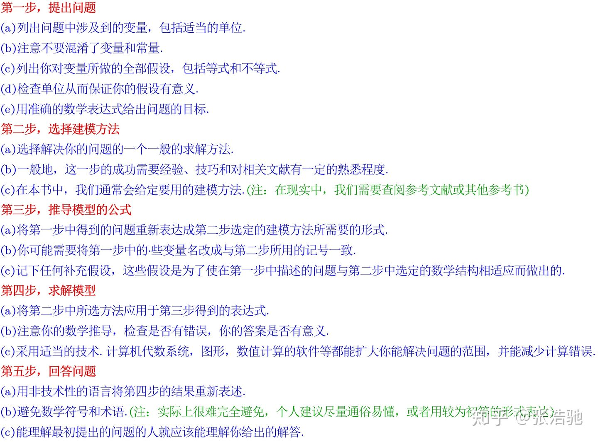
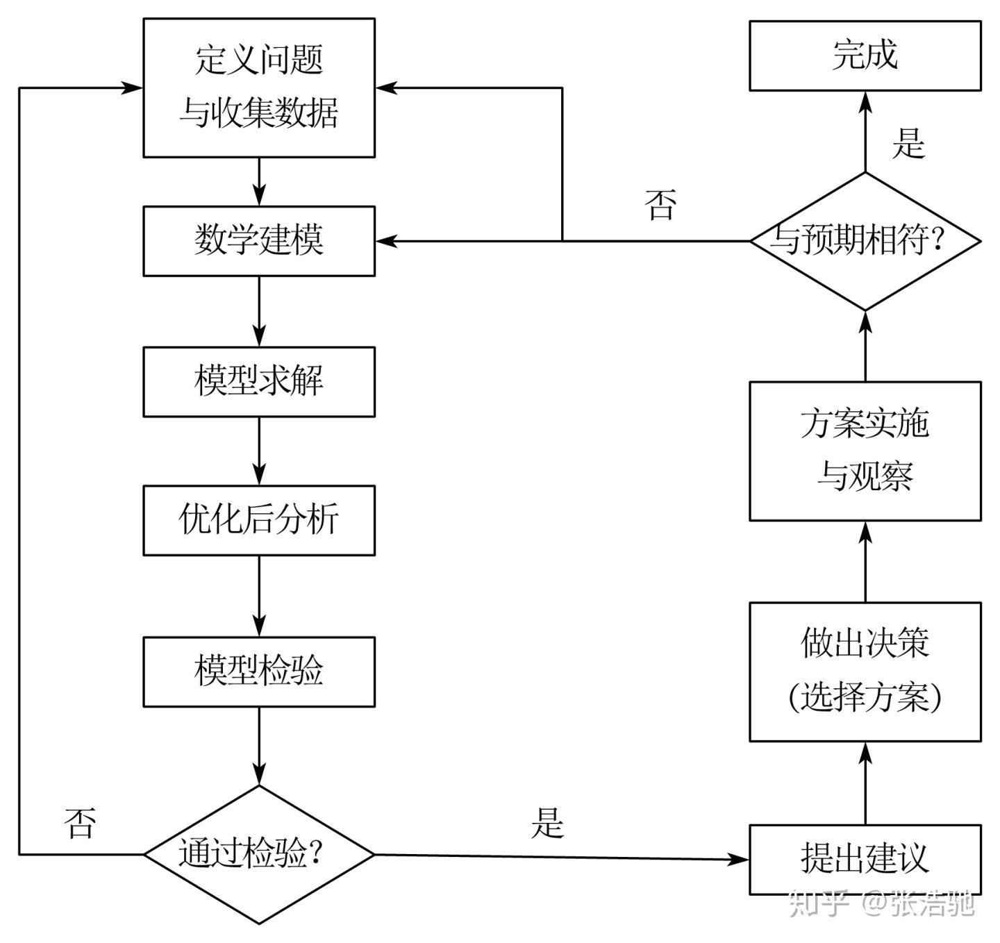
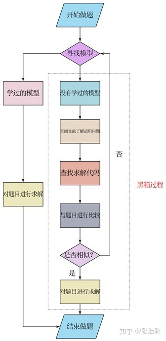

- [ ] 坚果云
- [ ] mybits plus

****
1. 数学建模大赛
	1. 参赛者根据题目要求，完成一篇包括模型假设，建立和求解，计算方法的设计和计算机实现，结果的分析和检验，模型的改进等方面的论文。
	2. 数学模型本质上就是根据实际问题近似的表述出一种数据结构。
	3. 数学模型的几个组成部分：
		1. 决策变量：决策者可以控制的变量，可控输入
		2. 环境变量：决策者不可控制的外界因素
		3. 目标函数：描述问题目标的数学方程
		4. 约束条件：问题制约
	4. 从技术上来说，数学建模从来都不是强迫症的乐园，模型总会有一些失真的情况。
	5. 数学建模的一般步骤
		. 
		
	6. 提出问题是关键，能够准确的提出问题，就相当于这个问题解决一半了。但幸运的是，对于广大技术工作者或数学建模竞赛爱好者来说，上述问题基本上都是现成的，都是由相关机构或者相关人员经过深思熟虑后考虑的问题，==我们只需要好好思考模型，去解决问题就好了。 #E91E63==
	7. 黑箱理论
	8. 

2. spring Boot
	1. 什么是SpringBoot，官网对他的解释，以及他的基本用法，如何用Springboot搭建一个项目？
		   1. 什么是restful Web项目
	 2. 关闭已开启的8888窗口，cmd命令行输入netstat -ano|findstr 8888,得到pid号码之后，再去任务管理器中的详细信息界面去关闭。
	 3. 前端模板使用 thymeleaf
3. thymeleaf 的配置问题
	1. ==在创建项目的时候就要进行thymeleft配置，IDEA自动生成 static和templates文件夹#F44336==
	2. 然后把js，css放单static文件夹中，在html文件中更改成thymeleft格式
		1. 文件头
		 ```html
		 <!doctype html>
		<html class="x-admin-sm" xmlns="http://www.w3.org/1999/html">
	   ```
	   2. js css路径
	     ```html
		<link rel="stylesheet" th:href="@{css/font.css}">
		<link rel="stylesheet" th:href="@{css/xadmin.css}">
		<script th:src="@{lib/layui/layui.js}" charset="utf-8"></script>
		<script type="text/javascript" th:src="@{js/xadmin.js}"></script>
		 ```
		3. 控制器
		```java
		@Controller
		public class HelloController {
			@GetMapping("/index")
			public String hello(Model model) {

				return "index";  //对应template的动态文件
			}

		}
		```
4. IDRA SpingBoot热部署
	1. 按照网上的教程一步一步的配。
	2. 可以更改一下延迟时间
	3. ==配置完之后重启，一定要重启！一定要重启！一定要重启！重要的事情说三遍 ！#E91E63==

5. 文件上传
	1. 更改最大文件文件限制，否则单词文件限制为1MB
		```javascript
		#设置依次上传一个文件的最大值
		spring.servlet.multipart.max-file-size=1024MB
		#设置上传所有文件的最大值
		spring.servlet.multipart.max-request-size=102400MB
		```
	1. 前端layui代码
		  ```javascript
		   //上传方式
		layui.use('upload', function () {
			var $ = layui.jquery,
				upload = layui.upload;


			//允许批量上传噪声文件数据
			var demoListView = $('#fileList')

				, uploadListIns = upload.render({
				elem: '.layui-btn-upload' //绑定元素
				, url: '/uploadNoise' //上传接口
				, multiple: true
				, accept: 'file'
				, auto: false
				, bindAction: '#uploadFile'
				, before: function (obj) {
					//预读本地文件示例，不支持ie8，文件提交上传前的回调
					obj.preview(function (index, file, result) {

					});
				}, choose: function (obj) {//选择文件之后的回调函数
					var files = this.files = obj.pushFile(); //将每次选择的文件追加到文件队列
					//首先清空列表,只保留本次上传的数据
					//demoListView.html(" ");
					//读取本地文件
					obj.preview(function (index, file, result) {

						let t = ['<tr id="upload-' + index + '">'


							, '<td>' +
							'<input type="checkbox" lay-filter="checkall" name="" lay-skin="primary" "></td>'
							, '<td>' + file.name + '</td>'
							, '<td>' + (file.size / 1024).toFixed(1) + 'kb</td>'
							, '<td>等待上传</td>'
							, '                                <td class="td-manage">\n' +
							'                                    <a class=“a-fly-upload” onclick="member_stop(this,\'10001\')" href="javascript:;" title="停用">\n' +
							'                                        <i class="layui-icon">&#xe62f;</i>\n' +
							'                                    </a>\n' +
							'                                    <a title="编辑" onclick="xadmin.open(\'编辑\',\'member-edit.html\',600,400)"\n' +
							'                                       href="javascript:;">\n' +
							'                                        <i class="layui-icon">&#xe642;</i>\n' +
							'                                    </a>\n' +
							'                                    <a onclick="" title="重传"\n' +
							'                                       href="javascript:;">\n' +
							'                                        <i class="layui-icon">&#xe631;</i>\n' +
							'                                    </a>\n' +
							'                                    <a title="删除" onclick="member_del(this,\'要删除的id\')" href="javascript:;">\n' +
							'                                        <i class="layui-icon">&#xe640;</i>\n' +
							'                                    </a>\n' +
							'                                </td>'
							, '</tr>']
						t = t.join('')
						var tr = $(t);

						//单个上传飞参数据
						tr.find()


						//单个重传
						tr.find('.demo-reload').on('click', function () {
							obj.upload(index, file);
						});

						//删除
						tr.find('.demo-delete').on('click', function () {
							delete files[index]; //删除对应的文件
							tr.remove();
							uploadListIns.config.elem.next()[0].value = ''; //清空 input file 值，以免删除后出现同名文件不可选
						});

						demoListView.append(tr);
						//重新渲染checkbox标签
						var form = layui.form;
						form.render('checkbox');

					});
				}
				, done: function (res,index,upload) {
					if ((res.code == 0)) { //上传成功
						var tr = demoListView.find('tr#upload-' + index)
							, tds = tr.children();
						tds.eq(3).html('<span style="color: #5FB878;">上传成功</span>');
						//tds.eq(3).html(''); //清空操作
						return delete this.files[index]; //删除文件队列已经上传成功的文件
					}
					this.error(index, upload);
					//上传完毕回调
				}
				, error: function (index, upload) {
					var tr = demoListView.find('tr#upload-' + index)
						, tds = tr.children();
					tds.eq(3).html('<span style="color: #FF5722;">上传失败</span>');
					//tds.eq(3).find('.demo-reload').removeClass('layui-hide'); //显示重传
				}
			});
		});
		  ```