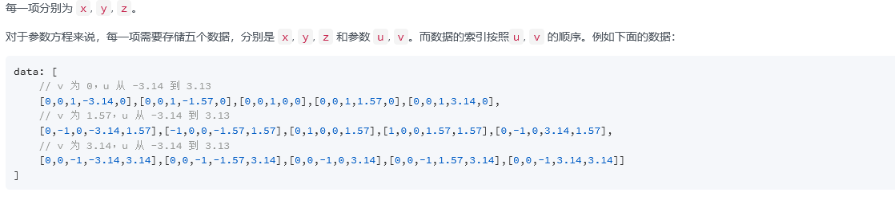

- [x] 口才练得是脑子的反应速度，这个才是主要问题。
***
1. 读取噪声文件和飞行参数文件，将读取后的文件放到ArrayList集合中。读取方法和解析方法都放到一个工具类中
2. 新发现：loombook是什么？
	1. lombok是什么？
		1. 通过简单的注解形式，帮助我们消除一些臃肿的代码。
	1. loombook的使用
		1. . 导入maven依赖
		```xml
		 <dependency>

			  <groupId>org.projectlombok</groupId>

			  <artifactId>lombok</artifactId>

			  <version>1.16.18</version>

			  <scope>provided</scope>// 在编译时候将带有loombook注解的类，正确的编译成class文件

		 </dependency>
		```
2. 将数据读取到对象里面。
2. 将读取后的数据显示出来。

****
 1. 3D曲线的数据表示，实验，采用数据的方式
	 1.使用js 生成数据，数据要是四维的，dimension也对应更改为四维的。
	 2.首先测试使用数据
2. 声学球3D显示
	1. 解决的关节点，数据的排列顺序，看官网surface的data,注意是<=pai。
	   
	 2. 加入dimension，增加维度
3. 代码：
   ```html
   <!DOCTYPE html>
	<html class="x-admin-sm" xmlns:th="http://www.thymeleaf.org">
	<head>
		<meta charset="UTF-8">
		<title>欢迎页面-X-admin2.2</title>
		<meta name="renderer" content="webkit">
		<meta http-equiv="X-UA-Compatible" content="IE=edge,chrome=1">
		<meta name="viewport"
			  content="width=device-width,user-scalable=yes, minimum-scale=0.4, initial-scale=0.8,target-densitydpi=low-dpi"/>
		<link rel="stylesheet" th:href="@{css/font.css}">
		<link rel="stylesheet" th:href="@{css/xadmin.css}">
		<script th:src="@{lib/layui/layui.js}" charset="utf-8"></script>
		<script type="text/javascript" th:src="@{js/xadmin.js}"></script>

		<!-- 让IE8/9支持媒体查询，从而兼容栅格 -->
		<!--[if lt IE 9]>
		<script src="https://cdn.staticfile.org/html5shiv/r29/html5.min.js"></script>
		<script src="https://cdn.staticfile.org/respond.js/1.4.2/respond.min.js"></script>
		<![endif]--></head>
	<style>

		.layui-layer-iframe iframe {
			background-color: transparent;
		}

		.layui-layer-content {
			background-color: transparent;
		}
	</style>

	<body style="background-color: transparent">

	<div class="layui-card-body" style="min-weight: 300px;margin-left: 30px">
		<a class="layui-btn layui-btn-small" style="line-height:1.6em;margin-top:3px;float:right"
		   onclick="display_refash()" title="刷新">
			<i class="layui-icon layui-icon-refresh" style="line-height:30px"></i></a>
		<div id="main" class="layui-col-sm12" style="width:400px;height: 400px;"></div>
	</div>
	</div>

	<script src="https://cdn.jsdelivr.net/npm/echarts/dist/echarts.min.js"></script>
	<script src="https://cdn.jsdelivr.net/npm/echarts-gl/dist/echarts-gl.min.js"></script>

	<script>


		var chartDom = document.getElementById('main');
		var myChart = echarts.init(chartDom);
		var option;

		var data = [];
		for (var v = 0; v <= Math.PI; v = v + (Math.PI / 20)) {
			for (var u = -Math.PI; u <=Math.PI; u += (Math.PI / 20)) {
				x = Math.sin(v) * Math.sin(u);
				y = Math.sin(v) * Math.cos(u);
				z = Math.cos(v);
				data.push([x, y, z, u, v, x+y+z]);
			}

		}
		console.log(data)
		option = {

			tooltip: {},
			visualMap: {

				show: true,
				dimension: 5,
				right: 0,
				calculable: true,
				min: -1,
				max: 1,
				inRange: {
					color: ['#313695', '#4575b4', '#74add1', '#abd9e9', '#e0f3f8', '#ffffbf', '#fee090', '#fdae61', '#f46d43', '#d73027', '#a50026']
				}
			},
			xAxis3D: {},
			yAxis3D: {},
			zAxis3D: {},
			grid3D: {
				axisLine: {
					lineStyle: {
						color: '#fff'
					}
				},
				axisPointer: {
					lineStyle: {
						color: '#ffbd67'
					}
				},
				viewControl: {
					// autoRotate: true
					// projection: 'orthographic'
				}
			}, toolbox: {
				feature: {
					saveAsImage: {}
				}
			},
			series: [{
				type: 'surface',
				dimensions: ['x', 'y', 'z', 'u', 'v', '声压值'],
				data: data

			}]
		};
		option && myChart.setOption(option);

		function display_refash() {
			//ajax请求
			$.ajax({
				//请求方式
				type: 'GET',
				//路径
				url: '/',
				//传递的参数

				xhrFields: {
					withCredentials: true
				},
				crossDomain: true,
				//返回的数据类型
				dataType: "json",
				//回调函数 ,成功时返回的数据存在形参data里
				success: function (data) {

				},
				error: function () {
					alert("连接失败");
				}
			});
		}
	</script>
	<script>var _hmt = _hmt || [];
	(function () {
		var hm = document.createElement("script");
		hm.src = "https://hm.baidu.com/hm.js?b393d153aeb26b46e9431fabaf0f6190";
		var s = document.getElementsByTagName("script")[0];
		s.parentNode.insertBefore(hm, s);
	})();</script>
	</body>

	</html>
   ```